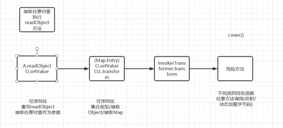
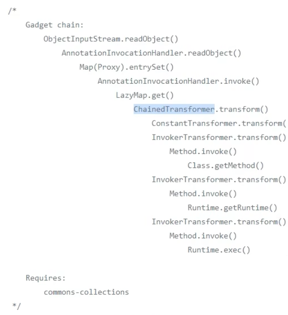

### 依赖包版本

jdk: 8u65

commons collections: 3.2.1

### 调试需要的sun源码版本

openJDK: changeset 11554:af660750b2f4

1. 下载后将其中的sun文件夹复制，在所使用的jdk目录下解压src.zip，将刚才的sun复制过来
2. 在idea中，在project structure -> platform setting -> SDKs 中选择对应的jdk，在Sourcepath中添加sun的路径
3. 这样在跟踪的时候就可以看到原来sun包下.class文件对应的源码

#### 调用链

#### 另外一条调用链

可以用lazyMap
