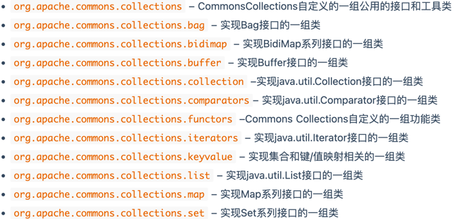

### Requirements

CC1的要求比较严格，但是CC6可以不受到jdk版本制约

#### CC6 = CC1 + URLDNS

为了方便，环境可以用与CC1相同的或者用jdk8u71(71中已经修复了CC1的漏洞)

JDK8u65

OpenJDK 8U65 与CC1相同替换sun包将.class替换为未编译的.java文件，方便debug

commons collections: 3.2.1

### 包结构

补充一下commonsCollections的包结构

